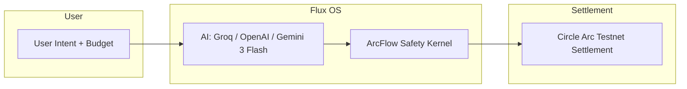

# Flux OS: The Deterministic Agentic Commerce Architecture

**One intent. One budget. One optimized cart. One orchestrated settlement—with on-chain proof.**

Flux OS is the cognitive layer for autonomous commerce: multi-retailer procurement, AI-driven ranking, simulated checkout, and **deterministic on-chain settlement** via the ArcFlow Safety Kernel and Circle’s Arc Testnet. No LLM ever touches a private key.

---

## VC Track: How We Meet the Brief

| Brief requirement | Implementation |
|------------------|-----------------|
| **Goals** — Understand intent, break into needs, discover/rank across retailers, single cart, orchestrate checkout | Natural-language or document input; AI extracts categories (Groq/OpenAI/Gemini 3 Flash); transparent scoring (cost, delivery, strategy); combined cart from Amazon, Walmart, TechData; ArcFlow kernel executes settlement (sandbox/Arc Testnet). |
| **2.1 Conversational brief and constraints** — Budget, deadline, preferences, structured spec | Form captures budget, deadline (days), strategy (cheapest / fastest / balanced). Optional image/PDF upload for intent. Output: structured cart (options array = shopping spec with price, delivery, retailer, reasoning). |
| **2.2 Multi-retailer discovery (at least 3)** — Real or mocked data; price, delivery, retailer per item | Three retailers: Amazon, Walmart, TechData. Mocked catalog with realistic hackathon items (snacks, badges, adapters, prizes). Each item: price, delivery_days, vendor_id, trust_score. |
| **2.3 Ranking engine (not just LLM)** — Transparent scoring; explain "Why is this option ranked #1?" | Deterministic scoring by strategy (price vs delivery weights). Per-item reason: Best Price / Fastest Delivery / Balanced. Tooltip shows reasoning. Dev panel shows model and latency (decision trace). |
| **2.4 Single combined cart** — Combined view, total cost, delivery per item, replace or optimize | Single Optimized Cart with all retailers; total and per-item delivery; re-rank by strategy; reset and try again. |
| **2.5 Checkout orchestration (safe demo)** — Payment once; agent fans out per retailer | One Execute Payment; ArcFlow kernel validates policy (whitelist, budget cap) then runs settlement (sandbox or Arc Testnet). Transaction hashes as proof. No real card data. |
| **Constraints** — No single-retailer; combined cart; at least 3 retailers; simulated/sandbox checkout; user can modify cart | Three retailers; single combined cart; re-rank and reset; checkout simulated/sandbox plus optional on-chain testnet; 403 on policy violation. |
| **Optional: Explain mode** | Live telemetry (model, latency); per-item AI reason; agent logs (ACTION / THOUGHT / OBSERVATION). |

**Innovation beyond the brief:** We add a **deterministic safety layer** (ArcFlow Kernel) and optional **on-chain proof of settlement** (Circle Arc Testnet). The AI proposes the cart; the kernel enforces policy and signs; execution is auditable. That matches the challenge vision: users describe outcomes, AI handles complexity, buying becomes one coherent experience.

---

## Architecture



| Stage | Description |
|-------|-------------|
| **User Intent** | Natural-language prompt (e.g. *"hackathon kit: snacks, badges, prizes"*) plus budget, deadline, and strategy. |
| **AI reasoning** | Text intent: Groq or OpenAI. Document (image/PDF): Gemini 3 Flash. Category extraction and scoring across vendors (Amazon, Walmart, TechData). |
| **ArcFlow Safety Kernel** | Deterministic policy gate: whitelisted merchants and max budget cap. No transaction is signed until checks pass. |
| **Circle Arc Testnet Settlement** | USDC transfers executed on Arc Testnet; transaction hashes returned as **On-Chain Proof of Settlement**. |

---

## The Trust Gap — and How We Close It

**Why we don’t give LLMs private keys**

- LLMs are non-deterministic and can hallucinate targets, amounts, or recipients.
- A single leaked or misused key can drain funds.
- Compliance and audit require **reproducible, policy-bound** execution.

**How the Deterministic Kernel solves it**

- **No key in the model.** The AI only produces a *cart* (items, vendors, amounts). The backend holds the key.
- **Policy before signing.** Every payment request is checked against:
  - **WHITELISTED_MERCHANTS** — only pre-approved vendor IDs can receive funds.
  - **MAX_BUDGET_CAP** — total cart value cannot exceed a hard cap.
- If either check fails, the API returns **403 Policy Violation** and **no transaction is signed**.
- Settlement runs in a dedicated service (ArcFlow Safety Kernel) with web3.py; transaction hashes are logged and returned to the frontend for transparent proof.

---

## Hackathon Compliance — Agentic Commerce

| Requirement | Status | Implementation |
|-------------|--------|----------------|
| **Multi-retailer** | Yes | Amazon, Walmart, TechData; vendor badges and trust scores in cart. |
| **Ranking engine** | Yes | AI scoring by strategy (cheapest / fastest / balanced); re-rank on strategy change. |
| **Simulated checkout** | Yes | Unified cart, delivery estimates, and simulated negotiation (e.g. agent-applied discounts). |
| **Agentic flow** | Yes | Plan → Act → Verify: intent → orchestration → ranking → payment with audit logs. |
| **On-chain settlement** | Yes | Circle Arc Testnet; USDC at `0x3600...`; RPC `https://rpc.testnet.arc.network`; Chain ID `5042002`. |
| **Deterministic safety** | Yes | Whitelist + budget cap enforced before any signing; 403 on policy violation. |
| **Proof of settlement** | Yes | Transaction hashes returned to frontend and displayed as “On-Chain Proof of Settlement” with explorer links. |

---

## Technical Specs

| Layer | Technology |
|-------|------------|
| **API** | FastAPI (Python), uvicorn |
| **Frontend** | Next.js 14, TypeScript, Tailwind CSS, Framer Motion |
| **AI** | **Intent (text):** Groq (Llama 3.3 70B) or OpenAI (gpt-4o-mini). **Document (image/PDF):** Google Gemini 3 Flash. Real API calls; fallback categories only when keys are missing or a call fails. |
| **Settlement** | web3.py, Circle USDC, Arc Testnet (RPC: `https://rpc.testnet.arc.network`, Chain ID: `5042002`, USDC: `0x3600000000000000000000000000000000000000`) |
| **Safety** | ArcFlow Safety Kernel: `WHITELISTED_MERCHANTS`, `MAX_BUDGET_CAP`; 403 on violation |

---

## Quick Start

**Required:** At least one of `OPENAI_API_KEY` or `GROQ_API_KEY` for text intent parsing. `GEMINI_API_KEY` for document (image/PDF) upload. Without keys, the backend uses fallback categories only.

```bash
# Backend
cd backend
python -m venv venv && source venv/bin/activate   # Windows: venv\Scripts\activate
pip install -r requirements.txt

# API keys (set at least one AI provider for full behavior)
export OPENAI_API_KEY=sk-...          # or
export GROQ_API_KEY=gsk_...           # for intent parsing
export GEMINI_API_KEY=...             # for document vision (Gemini 3 Flash)

# Optional: real Arc Testnet settlement (otherwise sandbox with mock tx hashes)
export PAYMENT_PRIVATE_KEY=0x-your-testnet-key

uvicorn main:app --reload --host 0.0.0.0 --port 8001

# Frontend (separate terminal)
cd frontend
npm install && npm run dev
```

| Service | URL |
|---------|-----|
| API | http://127.0.0.1:8001 |
| API docs | http://127.0.0.1:8001/docs |
| Dashboard | http://localhost:3000 |
| Arc Testnet Explorer | https://testnet.arcscan.app |

---

## API

| Method | Endpoint | Description |
|--------|----------|-------------|
| GET | `/` | Health check |
| POST | `/api/orchestrate` | Text intent: body `UserRequest`; calls Groq/OpenAI for categories; returns `options` and `telemetry`. |
| POST | `/api/upload_intent` | Document (image/PDF): multipart file; calls Gemini 3 Flash for intent; then same orchestration as above. Query params: `budget`, `strategy`. |
| POST | `/api/execute_payment` | ArcFlow settlement; body: cart (with `vendor_id` per item); returns `status`, `logs`, `transaction_hashes`. Returns 403 if policy (whitelist or budget cap) fails. |

---

## Project Structure

```
arcflow-commerce-agent/
├── assets/
├── backend/
│   ├── main.py
│   ├── models/schemas.py
│   ├── routers/procurement.py
│   ├── services/
│   │   ├── ai_engine.py
│   │   └── payment_solver.py   # ArcFlow Safety Kernel + Arc Testnet
│   ├── utils/logger.py
│   └── requirements.txt
├── frontend/
└── README.md
```

---

## Why This Matters (VC Track)

The brief says: *"The future of commerce isn't more filters or better search. It's delegation."*

**Technical depth:** Multi-provider AI (Groq, OpenAI, Gemini 3 Flash), explicit ranking (not black-box LLM output), policy-enforced settlement, and optional on-chain proof. The stack is production-style: FastAPI, typed schemas, async orchestration, and a safety kernel that never lets the model touch keys.

**Innovation and creativity:** Instead of "simulated checkout" only, we introduce a **deterministic safety kernel** and **verifiable settlement**. The agent suggests; the kernel decides. Judges can open Arc Testnet explorer links and see real transaction hashes. That is a clear step toward trustworthy agentic commerce.

**Agentic commerce, not chatbot:** End-to-end flow: intent (text or document) → breakdown → multi-retailer discovery → ranked combined cart → single checkout with audit trail. The user describes the outcome; the system handles the rest.

---

## License

MIT
