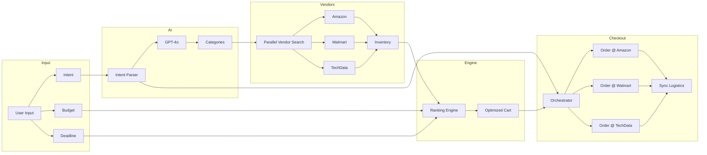

# Flux OS — Agentic Commerce on Arc

> **Online shopping is fragmented. Flux delegates it.**

Flux OS is a multi-retailer orchestration platform that aggregates Amazon, Walmart, and TechData into a single intelligent cart. An AI agent parses your intent, scouts vendors in parallel, ranks by price and delivery speed, and executes payment across retailers in one click.

---

## The Problem

- **Fragmented experience:** Switching between Amazon, Walmart, and niche retailers is tedious.
- **No unified optimization:** You manually compare prices, delivery times, and trust scores.
- **Checkout friction:** Multiple carts, multiple payments, multiple tracking numbers.

**Flux solves this:** One input (intent + budget + deadline) → one optimized cart → one payment fan-out.

---

## Hackathon Compliance (Judge Checklist)

| Requirement | Status | Implementation |
|-------------|--------|----------------|
| **Scenario** | ✅ Hackathon Host Kit (Option C) | Inventory prioritizes snacks, badges, adapters, prizes. Constraint capture: Intent, Budget, Deadline. |
| **Multi-Retailer** | ✅ Amazon, Walmart, TechData | Every cart item shows a **Retailer Badge**. Aggregates all three vendors. |
| **Ranking Engine** | ✅ Transparent scoring | Strategy dropdown: Cheapest / Fastest / Balanced. **Dynamic Re-Ranking** when strategy changes. |
| **AI Reasoning** | ✅ Visible "Why" factor | Each item has an **AI Reasoning** badge (e.g. Best Price, Fastest Delivery). Tooltip shows detailed reason. |
| **Simulated Checkout** | ✅ Orchestrated fan-out | Payment execution shows step-by-step: Authenticate → Place Order @ Amazon → Place Order @ Walmart → Sync Logistics. |
| **Safe Demo** | ✅ Sandbox | Pulsing banner: "SANDBOX ENVIRONMENT: MOCK PAYMENT GATEWAY ACTIVE". |
| **Adaptability (Rule 3)** | ✅ Re-ranking | Strategy dropdown above cart; changing it triggers re-animation and re-sorted items. |
| **Simulated Orchestration (Rule 2.5)** | ✅ Progress visualizer | Live Agent Activity: Parsing → Scouting → Ranking → Assembling. Checkout: Fan-out per retailer. |
| **Chain-of-Thought (Rule 2.3)** | ✅ Reasoning logs | Terminal shows `[THOUGHT]`, `[ACTION]`, `[OBSERVATION]` in distinct colors. |
| **Dev Mode / Telemetry** | ✅ Engineering proof | Toggle shows LLM model, latency, token usage. Proves real API calls. |
| **Autonomous Negotiation** | ✅ Agent negotiates | 1 in 4 items get a simulated coupon discount; UI shows ~~$50~~ → $45 with "Agent Negotiated" badge. |

---

## Architecture



**Flow:** `User Input → Intent Parser (GPT-4o) → Parallel Vendor Search (Async) → Ranking Engine → Orchestrator`

---

## Tech Stack

| Layer | Technology |
|-------|------------|
| **Frontend** | Next.js 14, Tailwind CSS, Framer Motion, TypeScript |
| **Backend** | FastAPI, Python 3.9+ |
| **AI** | OpenAI GPT-4o (intent parsing, fallback: mock categories) |
| **API** | REST on port 8001 |

---

## Quick Start

### 1. Clone & enter

```bash
git clone https://github.com/yourusername/arcflow-commerce-agent.git
cd arcflow-commerce-agent
```

### 2. Backend

```bash
cd backend
python -m venv venv
source venv/bin/activate   # Windows: venv\Scripts\activate
pip install -r requirements.txt
echo "OPENAI_API_KEY=sk-your-key" > .env
uvicorn main:app --reload --host 0.0.0.0 --port 8001
```

Backend: **http://127.0.0.1:8001** | Docs: **http://127.0.0.1:8001/docs**

### 3. Frontend (new terminal)

```bash
cd frontend
npm install
npm run dev
```

Frontend: **http://localhost:3000**

### 4. Use the app

1. **Intent:** e.g. *"I need a hackathon kit with snacks, badges, adapters, prizes"*
2. **Budget:** e.g. `500`
3. **Deadline:** e.g. `7` days
4. **Strategy:** Cheapest | Fastest | Balanced
5. Click **INITIATE** → review optimized cart with retailer badges
6. Change **Strategy** to re-rank
7. Click **Execute Payment** → watch fan-out simulation

---

## Project Structure

```
arcflow-commerce-agent/
├── backend/
│   ├── main.py                 # FastAPI app
│   ├── models/schemas.py       # Pydantic models
│   ├── routers/procurement.py  # Orchestrate, execute_payment, Scenario C inventory
│   ├── services/ai_engine.py   # Intent parsing, scoring, telemetry
│   └── requirements.txt
├── frontend/
│   ├── src/app/
│   │   ├── page.tsx            # Flux OS dashboard
│   │   ├── layout.tsx
│   │   └── globals.css
│   ├── src/components/dashboard/
│   │   ├── ProcurementForm.tsx # Intent, Budget, Deadline
│   │   ├── ResultsGrid.tsx     # Retailer badges, AI reasoning, strategy
│   │   ├── LiveTerminal.tsx    # [THOUGHT]/[ACTION]/[OBSERVATION]
│   │   ├── ProgressVisualizer.tsx
│   │   ├── DevModeTelemetry.tsx
│   │   └── WorkflowStepper.tsx
│   └── package.json
└── README.md
```

---

## API Endpoints

| Method | Endpoint | Description |
|--------|----------|-------------|
| POST | `/api/orchestrate` | AI procurement orchestration. Returns `{ options, telemetry }`. |
| POST | `/api/execute_payment` | Simulate secure payment fan-out across retailers. |

---

## License

MIT
