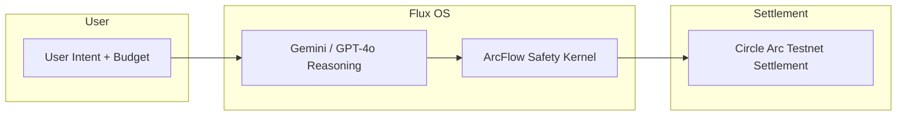

# Flux OS: The Deterministic Agentic Commerce Architecture

**One intent. One budget. One optimized cart. One orchestrated settlement—with on-chain proof.**

Flux OS is the cognitive layer for autonomous commerce: multi-retailer procurement, AI-driven ranking, simulated checkout, and **deterministic on-chain settlement** via the ArcFlow Safety Kernel and Circle’s Arc Testnet. No LLM ever touches a private key.

---

## Architecture



| Stage | Description |
|-------|-------------|
| **User Intent** | Natural-language prompt (e.g. *"hackathon kit: snacks, badges, prizes"*) plus budget, deadline, and strategy. |
| **Gemini / GPT-4o Reasoning** | Intent parsing, category extraction, and scoring across vendors (Amazon, Walmart, TechData). |
| **ArcFlow Safety Kernel** | Deterministic policy gate: whitelisted merchants and max budget cap. No transaction is signed until checks pass. |
| **Circle Arc Testnet Settlement** | USDC transfers executed on Arc Testnet; transaction hashes returned as **On-Chain Proof of Settlement**. |

---

## The Trust Gap — and How We Close It

**Why we don’t give LLMs private keys**

- LLMs are non-deterministic and can hallucinate targets, amounts, or recipients.
- A single leaked or misused key can drain funds.
- Compliance and audit require **reproducible, policy-bound** execution.

**How the Deterministic Kernel solves it**

- **No key in the model.** The AI only produces a *cart* (items, vendors, amounts). The backend holds the key.
- **Policy before signing.** Every payment request is checked against:
  - **WHITELISTED_MERCHANTS** — only pre-approved vendor IDs can receive funds.
  - **MAX_BUDGET_CAP** — total cart value cannot exceed a hard cap.
- If either check fails, the API returns **403 Policy Violation** and **no transaction is signed**.
- Settlement runs in a dedicated service (ArcFlow Safety Kernel) with web3.py; transaction hashes are logged and returned to the frontend for transparent proof.

---

## Hackathon Compliance — Agentic Commerce

| Requirement | Status | Implementation |
|-------------|--------|----------------|
| **Multi-retailer** | ✅ | Amazon, Walmart, TechData; vendor badges and trust scores in cart. |
| **Ranking engine** | ✅ | AI scoring by strategy (cheapest / fastest / balanced); re-rank on strategy change. |
| **Simulated checkout** | ✅ | Unified cart, delivery estimates, and simulated negotiation (e.g. agent-applied discounts). |
| **Agentic flow** | ✅ | Plan → Act → Verify: intent → orchestration → ranking → payment with audit logs. |
| **On-chain settlement** | ✅ | Circle Arc Testnet; USDC at `0x3600...`; RPC `https://rpc.testnet.arc.network`; Chain ID `5042002`. |
| **Deterministic safety** | ✅ | Whitelist + budget cap enforced before any signing; 403 on policy violation. |
| **Proof of settlement** | ✅ | Transaction hashes returned to frontend and displayed as “On-Chain Proof of Settlement” with explorer links. |

---

## Technical Specs

| Layer | Technology |
|-------|------------|
| **API** | FastAPI (Python), uvicorn |
| **Frontend** | Next.js 14, TypeScript, Tailwind CSS, Framer Motion |
| **AI** | OpenAI GPT-4o (intent parsing, scoring, reasoning) |
| **Settlement** | web3.py, Circle USDC, **Arc Testnet** (RPC: `https://rpc.testnet.arc.network`, Chain ID: `5042002`, USDC: `0x3600000000000000000000000000000000000000`) |
| **Safety** | ArcFlow Safety Kernel: `WHITELISTED_MERCHANTS`, `MAX_BUDGET_CAP`; 403 on violation |

---

## Quick Start

```bash
# Backend
cd backend
python -m venv venv && source venv/bin/activate   # Windows: venv\Scripts\activate
pip install -r requirements.txt
export OPENAI_API_KEY=sk-your-key
# Optional: real Arc Testnet settlement (otherwise sandbox mode with mock tx hashes)
export PAYMENT_PRIVATE_KEY=0x-your-testnet-key
uvicorn main:app --reload --host 0.0.0.0 --port 8001

# Frontend (separate terminal)
cd frontend
npm install && npm run dev
```

| Service | URL |
|---------|-----|
| API | http://127.0.0.1:8001 |
| API docs | http://127.0.0.1:8001/docs |
| Dashboard | http://localhost:3000 |
| Arc Testnet Explorer | https://testnet.arcscan.app |

---

## API

| Method | Endpoint | Description |
|--------|----------|-------------|
| GET | `/` | Health check |
| POST | `/api/orchestrate` | Orchestration; body: `UserRequest`; returns `options` + `telemetry` |
| POST | `/api/execute_payment` | ArcFlow settlement; body: cart (with `vendor_id` per item); returns `status`, `logs`, `transaction_hashes`. **403** if policy (whitelist or budget cap) fails. |

---

## Project Structure

```
arcflow-commerce-agent/
├── assets/
├── backend/
│   ├── main.py
│   ├── models/schemas.py
│   ├── routers/procurement.py
│   ├── services/
│   │   ├── ai_engine.py
│   │   └── payment_solver.py   # ArcFlow Safety Kernel + Arc Testnet
│   ├── utils/logger.py
│   └── requirements.txt
├── frontend/
└── README.md
```

---

## License

MIT
